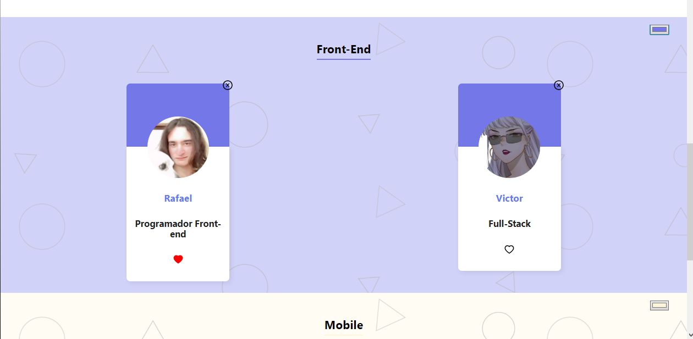
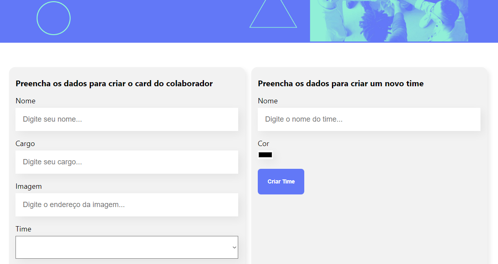

## Organizador de times com React

Este projeto faz parte da formação React da Alura, é uma página única com um formulário de cadastro de colaboradores, quando um colaborador novo é cadastrado, aparece na área do seu time.

### Bibliotecas usadas

- uuid
* hex-to-rgba
+ react-icons

### `npm start`

Roda a aplicação

 

